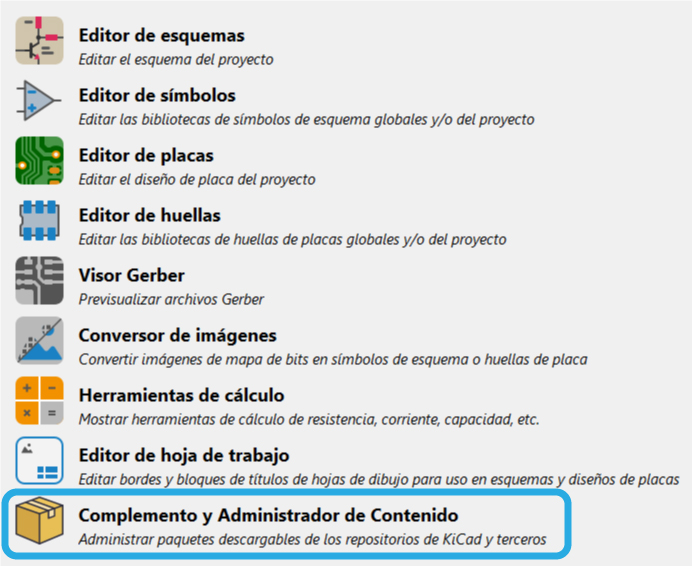
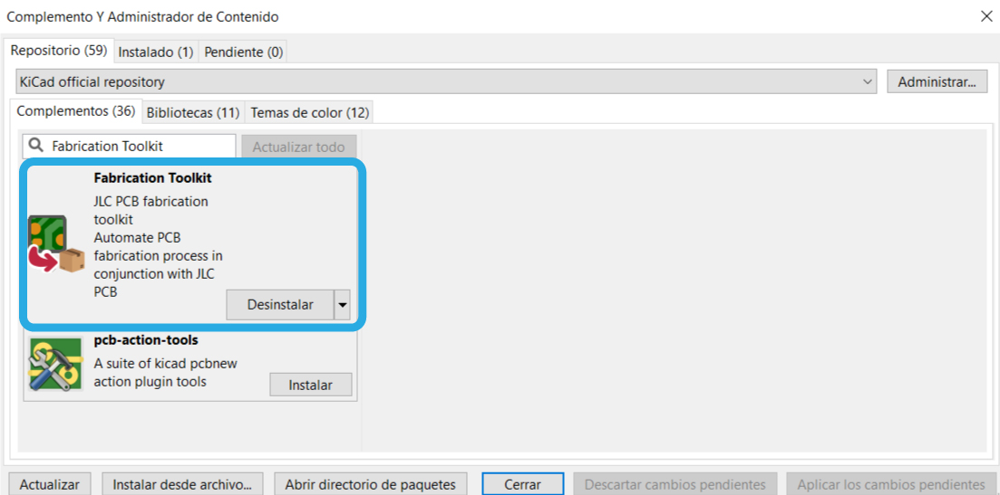
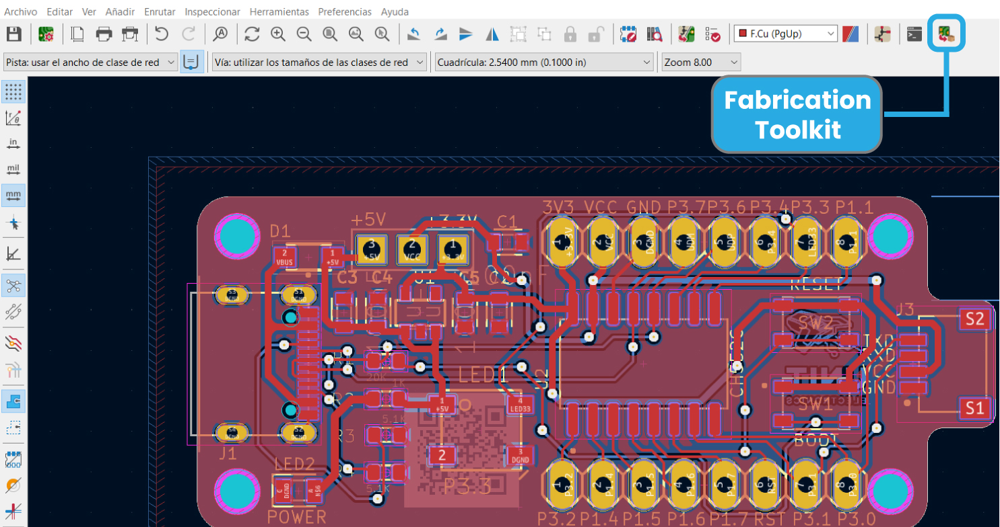
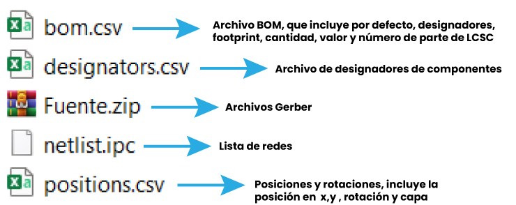

# Exportar archivos de fabricación en KiCad
Esta guía sirve como referencia para exportar archivos de fabricación como Gerber, BOM o de posiciones desde la aplicación Fabrication ToolKit de JLCPCB

__*Nota:__ Esta guía se realizó tomando como base la versión 7.0 de KiCad

## Contenido
- [Exportar archivos de fabricación en KiCad](#exportar-archivos-de-fabricación-en-kicad)
  - [Contenido](#contenido)
  - [Instalación de Fabrication Toolkit](#instalación-de-fabrication-toolkit)
  - [Exportación de archivos](#exportación-de-archivos)
- [Exportar-archivos-de-fabricacion-en-KiCad](#exportar-archivos-de-fabricacion-en-kicad)
- [Exportar-archivos-de-fabricacion-en-KiCad](#exportar-archivos-de-fabricacion-en-kicad-1)

## Instalación de Fabrication Toolkit

Fabrication Toolkit es una herramienta de KiCad diseñada para generar de forma rápida y sencilla todos los archivos necesarios para fabricar una PCB, para instalar esta herramienta hay que seguir los siguientes pasos:

1. Desde el menú de inicio de KiCad, acceder al menú de __Complemento y Administrador de Contenido__

1. Dentro del menú de complementos, buscar a través de la barra de búsqueda: "__Fabrication Toolkit__" e instalar el complemento

[Subir a contenido](#contenido)

## Exportación de archivos

Para la exportación de archivos debemos ya tener una PCB diseñada, por defecto el plugin de Fabrication Toolkit nos da un campo en los archivos que vamos a generar llamado __LCSC Part#__, al hacer clic derecho sobre un componente podremos acceder a un menú llamado __Propiedades del símbolo__, dentro de estas se puede agregar un nuevo campo llamado __LCSC Part#__ y darle el valor de un componente de LCSC Electronics para tenerlo como referencia al exportar los archivos

Este paso anterior es completamente opcional, sin embargo ayuda para tener una referencia de que componente corresponde al footprint.

Para exportar los archivos, hay que ir al editor de PCB y en la parte de arriba donde se encuentra las herramientas, se encuentra el ícono del Fabrication Toolkit:

Al darle click al icono, automáticamente generará una serie de archivos que se quedan guardados en la carpeta del proyecto:

[Subir a contenido](#contenido)

---

⌨️ con ❤️ por UNIT-Electronics 😊 

# Exportar-archivos-de-fabricacion-en-KiCad
# Exportar-archivos-de-fabricacion-en-KiCad
